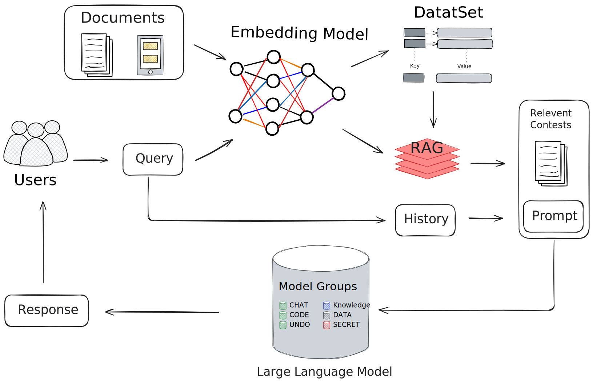

# Simple RAG

<p align="center">
  <a href="./README.md">English</a> |
  <a href="./README_zh.md">简体中文</a>
</p>

<details open>
<summary><b>📕 Table of Contents</b></summary>

- 💡 [Project Overview](#-project-overview)
- 🔥 [Recent Updates](#-recent-updates)
- 🔎 [System Architecture](#-system-architecture)
- 🎬 [Future Enhancements](#-future-enhancements)
- 📚 [Technical Documentation](#-technical-documentation)
- 📜 [Project Deployment](#-project-deployment)

</details>

## 💡 Project Overview

Simple RAG is a retrieval-augmented generation (RAG) system built using LangChain. It enables document loading and intelligent Q&A, serving as a foundational framework for RAG technology that facilitates learning and expansion.

## 🔥 Recent Updates

- **2024-04-02**: Introduced [chat_chain](Technical_note/chat_chain.md) for RAG data flow with contextual support; implemented a basic front-end deployment using [HTML](wowrag/templates/index.html).
- **2024-04-01**: Developed [Embedding](wowrag/embedding.py) for document ingestion, data cleaning, embedding generation, ChromaDB storage, and similarity search.
- **2024-03-31**: Integrated [Embedding model](wowrag/rag_model.py) and [LLM model](wowrag/llm_model.py) with API key-based invocation using LangChain.
- **2024-03-30**: Implemented embedding and LLM model API key calls based on OpenAI.

## 🔎 System Architecture

<div align="center" style="margin: 10px 0;">

</div>

## 🎬 Future Enhancements

### [llm_model.py](wowrag/llm_model.py)

- [ ] Support multiple LLM API keys
- [ ] Enable local model usage

### [rag_model.py](wowrag/rag_model.py)

- [ ] Support multiple embedding API keys
- [ ] Enable local model usage

### [embedding.py](wowrag/embedding.py)

- [ ] Data cleaning strategies
- [ ] Data segmentation strategies
- [ ] Query strategies
- [ ] Support for various data storage formats
- [ ] Vector data management (removing duplicate vectors)
- [ ] Support for additional data formats

### [frontend.py](wowrag/frontend.py)

- [ ] Improve front-end UI
- [ ] Enable independent document and dataset loading
- [ ] Implement user registration and authentication
- [ ] Develop user database management

## 📚 Technical Documentation

- [Chat Chain](Technical_note/chat_chain.md)

## 📜 Project Deployment

### Install Dependencies

```bash
pip install -r requirements.txt
```

### Environment Configuration

1. Create a `.env` file and add your OpenAI API key:
```
OPENAI_API_KEY=your_api_key
```

### Usage Instructions

1. Prepare your documents (supports PDF and TXT formats).
2. Run `frontend.py`.
3. Open http://127.0.0.1:5000/ in a browser.

### Important Notes

- Ensure sufficient disk space for vector database storage.
- A valid OpenAI API key is required.
- Python 3.8 or later is recommended.
