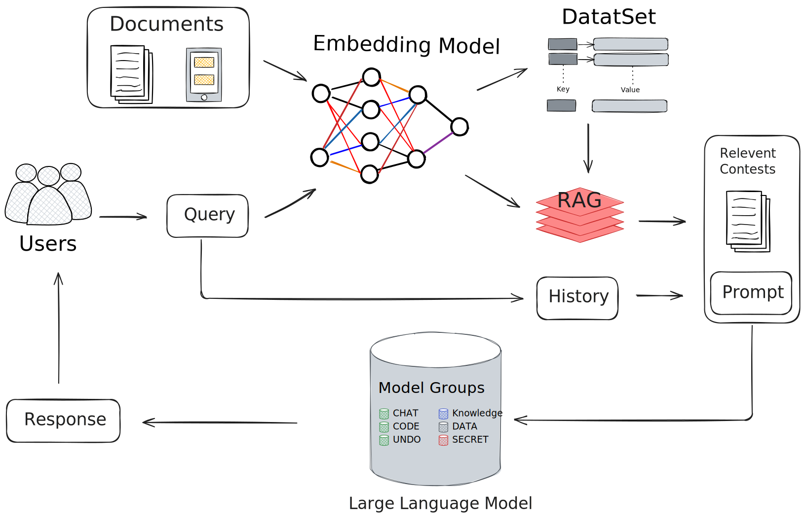

<h1 align="center">Simple RAG</h1>

<p align="center">
  <a href="./README.md">English</a> |
  <a href="./README_zh.md">简体中文</a>
</p>

<details open>
<summary><b>📕 Table of Contents</b></summary>

- 💡 [项目概述](#-项目概述)
- 🔥 [近期更新](#-近期更新)
- 🔎 [系统架构](#-系统架构)
- 🎬 [目标拓展](#-目标拓展)
- 📚 [技术文档](#-技术文档)
- 📜 [项目部署](#-项目部署)

</details>

## 💡 项目概述

基于LangChain实现的简单RAG（检索增强生成）系统，可以加载文档并进行智能问答。作为基础的rag技术框架，方便扩展和学习。

## 🔥 近期更新

- 2024-04-02 [chat_chain](Technical_note/chat_chain.md) rag 数据流，支持上下文；[HTML](wowrag/templates/index.html) 简单的前端部署
- 2024-04-01 [Embedding](wowrag/embedding.py) 文献读入，数据清洗，embedding，Chroma数据保存，相似度查找
- 2024-03-31 基于 langchain，完成 [Emdedding model](wowrag/rag_model.py) 以及 [llm model](wowrag/llm_model.py) 的 API_KEY 调用
- 2024-03-30 基于 openai，完成 Emdedding model 以及 llm model 的 API_KEY 调用

## 🔎 系统架构

<div align="center" style="margin: 10px 0;">

</div>

## 🎬 目标拓展

### [llm_model.py](wowrag/llm_model.py)

- [ ] 1. 切换不同 LLM API_KEY
- [ ] 2. 支持本地模型

### [rag_model.py](wowrag/rag_model.py)

- [ ] 1. 切换不同 Embedding API_KEY
- [ ] 2. 支持本地模型

### [embedding.py](wowrag/embedding.py)

- [ ] 1. 数据清洗策略
- [ ] 2. 数据分割策略
- [ ] 3. 数据查询策略
- [ ] 4. 不同的数据保存格式
- [ ] 5. 向量数据管理（删除重复的向量数据）
- [ ] 6. 支持更多格式的数据

### [frontend.py](wowrag/frontend.py)

- [ ] 1. 优化前端界面
- [ ] 2. 自主加载文献和数据集
- [ ] 3. 用户注册和登录
- [ ] 4. 用户数据库管理

## 📚 技术文档

- [chatchain](Technical_note/chat_chain.md)

## 📜 项目部署

### 安装依赖

```bash
pip install -r requirements.txt
```

### 环境配置

1. 创建`.env`文件并添加你的OpenAI API密钥：
```
OPENAI_API_KEY=你的API密钥
```

### 使用方法

1. 准备你的文档（支持pdf,txt格式）
2. 运行`frontend.py`程序
3. 浏览器打开 http://127.0.0.1:5000/

### 注意事项

- 确保有足够的磁盘空间存储向量数据库
- 需要有效的OpenAI API密钥
- 建议使用Python 3.8或更高版本 