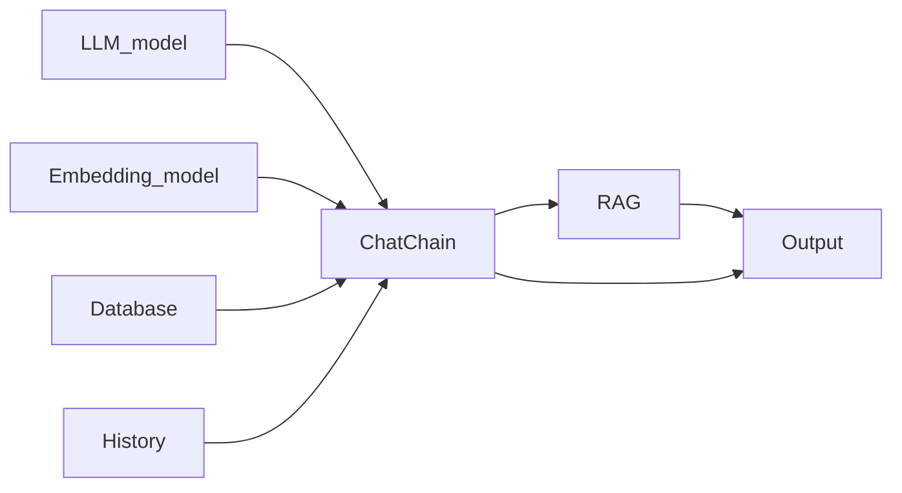

## Technology detail of chat_chain

The code of chat_chain base on the `langchain`. In this part, we need to bulid a chat chain of LLM. The basic function is:

- Support different llm models (Local model or API_KEY)
- Support different Embedding models (Local model or API_KEY)
- Support retrieval-augmented generation (RAG)
- conversation with streaming

### Pip what we need

|Import|Purpose|
|:-|:-|
|`llm_deepseek`|Initializes a large language model (LLM) for generating responses.|
|`MyEmbeddings`|Converts text into vector embeddings for retrieval.|
|`chroma`|Stores and retrieves embeddings from a vector database.|
|`ChatPromptTemplate`|Formats prompts for the LLM.|
|`HumanMessage/AIMessage`|Tracks conservation history for multi-turn interactions.|
|`RunableBranch/RunablePassthrough`|Manages conditional execution in the retrieval pipeline.|
|`StrOutputParser`|Converts LLM responses into human-readable text.|

### Framework



#### Initialization

#### 1. Initialize llm model

```bash
        # Initialize LLM
        self.llm = llm_model if llm_model is not None else llm_deepseek()
```

#### 2. Initialize embedding model and database

```bash
# Check if persist_directory exists and contains data
self.use_rag = False
if persist_directory and os.path.exists(persist_directory):
    try:
        # Try to initialize the vector store to check if it contains data
        embedding = embedding_model if embedding_model is not None else MyEmbeddings()
        vector_store = Chroma(
            embedding_function=embedding,
            persist_directory=persist_directory
        )
        # Check if the collection exists and has documents
        if vector_store._collection and vector_store._collection.count() > 0:
            self.use_rag = True
            self.embedding = embedding
            self.vector_store = vector_store
    except Exception:
        # If any error occurs during initialization, don't use RAG
        pass
```

#### 3. Initialize Prompt

```bash
# Store custom prompts
self.rag_system_prompt = rag_system_prompt
self.non_rag_system_prompt = non_rag_system_prompt
self.condense_question_prompt = condense_question_prompt

if self.use_rag:
    # Initialize retriever
    self.retriever = self.vector_store.as_retriever(search_kwargs={"k": 3})
    
    # Set system prompt for QA with RAG
    if self.rag_system_prompt is None:
        self.rag_system_prompt = (
            "You are a professional Q&A assistant. Please use the retrieved context to answer the user's question. "
            "If you don't know the answer, just say you don't know. Please keep your answers concise. "
            "\n\n"
            "{context}"
        )
    
    # Set system prompt for question condensation
    if self.condense_question_prompt is None:
        self.condense_question_system_template = (
            "Please refine the user's latest question based on the chat history. "
            "If the latest question doesn't need refinement, return the original question."
        )
    else:
        self.condense_question_system_template = self.condense_question_prompt
    
    # Create QA prompt template
    self.qa_prompt = ChatPromptTemplate([
        ("system", self.rag_system_prompt),
        ("human", "{input}"),
    ])
    
    # Create question condensation prompt template
    self.condense_question_prompt = ChatPromptTemplate([
        ("system", self.condense_question_system_template),
        ("human", "{input}"),
    ])
```

#### 4. Create Document Retrieval Branch

```bash
self.retrieve_docs = RunnableBranch(
    # Branch 1: Direct retrieval when no chat history
    (lambda x: not x.get("chat_history", False), 
     (lambda x: x["input"]) | self.retriever),
    # Branch 2: Condense question first when chat history exists
    self.condense_question_prompt | self.llm | StrOutputParser() | self.retriever,
)
```

#### 5. Create document combination function

```bash
def combine_docs(docs):
    return "\n\n".join(doc.page_content for doc in docs["context"])
```

#### 6. Create Chat Chain

```bash
# Create document retrieval branch
self.retrieve_docs = RunnableBranch(
    # Branch 1: Direct retrieval when no chat history
    (lambda x: not x.get("chat_history", False), 
        (lambda x: x["input"]) | self.retriever),
    # Branch 2: Condense question first when chat history exists
    self.condense_question_prompt | self.llm | StrOutputParser() | self.retriever,
)

# Create document combination function
def combine_docs(docs):
    return "\n\n".join(doc.page_content for doc in docs["context"])

# Create QA chain with RAG
self.qa_chain = (
    RunnablePassthrough.assign(context=combine_docs)  # Step 1: Combine retrieved documents
    | self.qa_prompt  # Step 2: Format the query into a structured prompt
    | self.llm  # Step 3: Generate an answer using the LLM
    | StrOutputParser()  # Step 4: Extract the plain text response
)

# Create complete chat chain with RAG
self.chat_chain = RunnablePassthrough.assign(
    context=(lambda x: x) | self.retrieve_docs
).assign(answer=self.qa_chain)
```